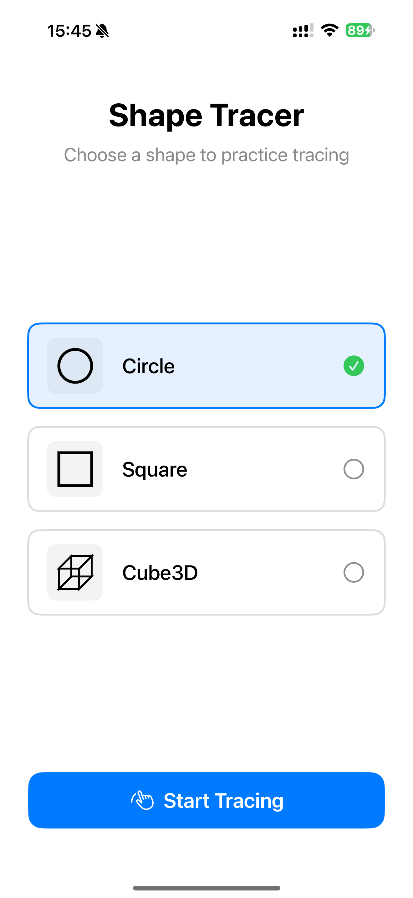
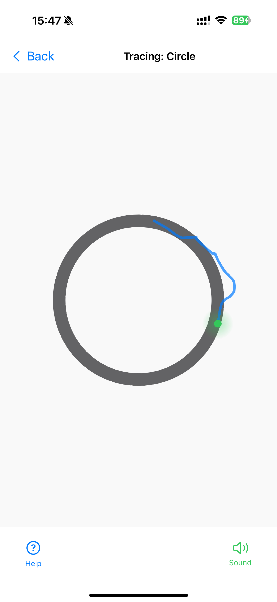
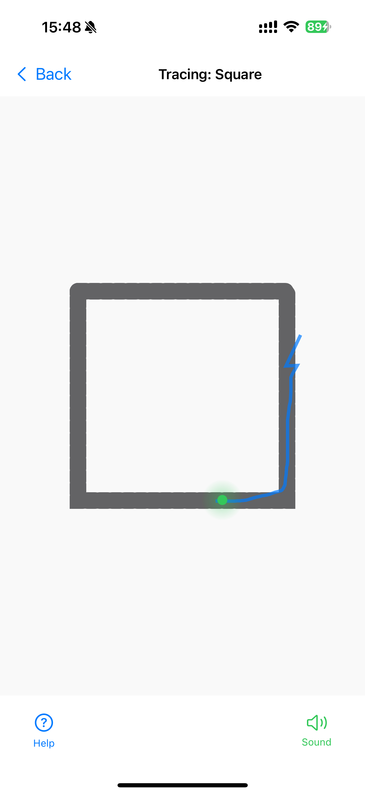
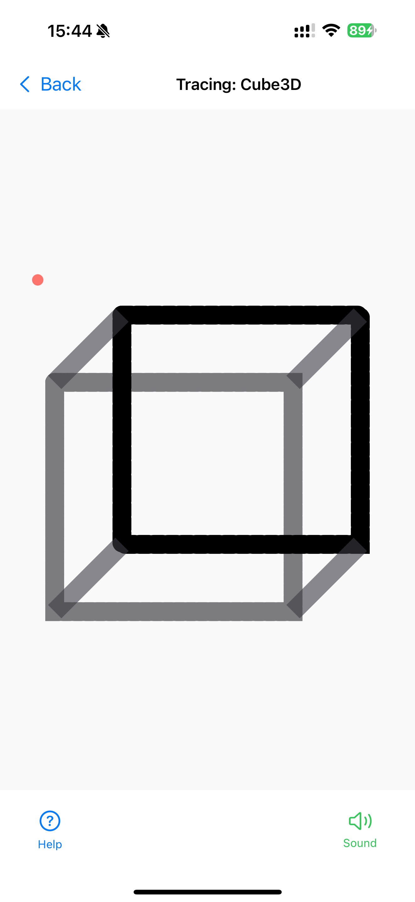
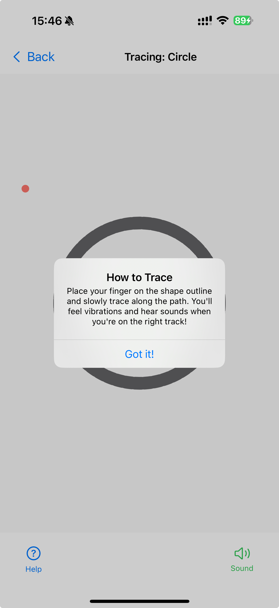

# ShapeTracer

---

## 1. Summary

**ShapeTracer** is an interactive iOS app built with SwiftUI, designed to help users practice tracing geometric shapes (circle, square, and 3D cube) with real-time multimodal feedback. As users trace the shape outlines with their finger, they receive instant visual, haptic, and auditory cues, including enhanced feedback at shape vertices. The app prioritizes accessibility, featuring VoiceOver compatibility and large, clearly labeled tappable areas.

**Screenshots / Demo:**  
### Homepage

### Shape Selection - Circle

### Shape Selection - Square

### Shape Selection - 3D Cube

### Tracing Feedback Message

---

## 2. Focus Areas

- **Accessibility:**  
  Designed for VoiceOver compatibility, with clear labels and large touch targets for all controls and interactive regions, ensuring the app is usable and inclusive for people of all abilities.

- **Multimodal Feedback:**  
  Implemented immediate, continuous haptic, auditory, and visual feedback to reinforce correct tracing, with stronger cues at vertices, so users receive real-time guidance and encouragement as they practice.

- **Scalable Shape Logic:**  
  Built extensible tracing validation supporting both 2D and 3D shapes, making it easy to add more complex shapes and expand the app’s educational value in the future.

- **Clean, Simple UI:**  
  Developed a visually appealing and user-friendly interface, using bold outlines and easily recognizable icons, to lower the learning curve and help users of all ages quickly engage with the app.

  
- **MVVM Architecture:**
  Utilized the Model-View-ViewModel (MVVM) pattern for a clear separation of concerns, improved code organization, and easier testing and maintenance. 
  This structure ensures that UI code stays simple and declarative, while interaction and feedback logic remains reusable and testable.

---

## 3. Time Allocation

- **Total Hours:** ~12–15 hours  
  **Breakdown:**
  - Shape rendering and tracing validation: ~4 hours
  - Feedback (haptics/audio/visual): ~3 hours
  - Accessibility/VoiceOver: ~2 hours
  - UI/UX and icon design: ~1 hours
  - Testing, bug-fixing, and refactoring: ~3–4 hours

---

## 4. Decisions & Trade-offs

- **Native SwiftUI, No 3rd-Party Libraries:**  
  Chose native Apple APIs for maximum reliability, reviewability, and accessibility support.

- **Cube as Wireframe Projection:**  
  Represented the 3D cube as a simple wireframe in 2D using custom drawing, for clear visual feedback and ease of tracing.

- **Feedback Simplicity:**  
  Leveraged system-provided haptics and sound APIs for reliable, low-latency feedback, keeping implementation straightforward for the prototype.

- **Continuous Feedback:**  
  Provided feedback on every finger movement to maximize responsiveness, but ensured system performance by rate-limiting as needed.

- **Unit Testing:**  
  Focused on validating tracing logic and feedback accuracy through robust unit tests.

---

## 5. Least Complete Area / Next Steps

- **Additional Shapes:**  
  Plan to expand with more complex and custom shapes (e.g., polygons, curves).

- **Advanced Progress Tracking:**  
  Would improve progress measurement using a more granular path coverage algorithm.

- **Enhanced Accessibility:**  
  I would like to further improve support for users with visual impairments by exploring custom VoiceOver actions, gesture alternatives, and richer audio descriptions.
  Ensuring that users who rely on assistive technologies can fully participate and benefit from the tracing experience.
  
- **Feedback Customization:**  
  Would add user options for sound/tone types and haptic patterns.

- **Data Logging/Export:**  
  Potential to record and export user tracing data for research or skill tracking.

---

## 6. Research Relevance

ShapeTracer isn’t just a technical demo—it’s designed as a hands-on research tool to better understand how people interact with touch-based shapes, especially when accessibility is a priority. By providing instant feedback through sound, haptics, and visuals, the app helps researchers explore how different types of cues can support both users with and without disabilities. It also makes it easier to study how shape complexity affects tracing ability. The flexible, modular structure means ShapeTracer can quickly be adapted for new research questions or to collect data in future studies.

---

**Thank you for reviewing ShapeTracer!**

---
